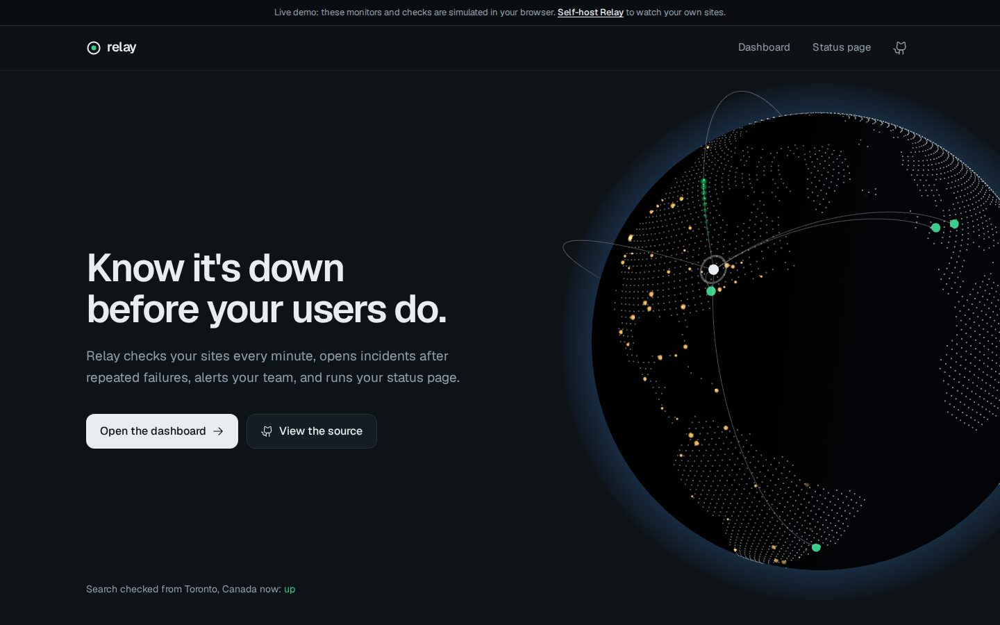
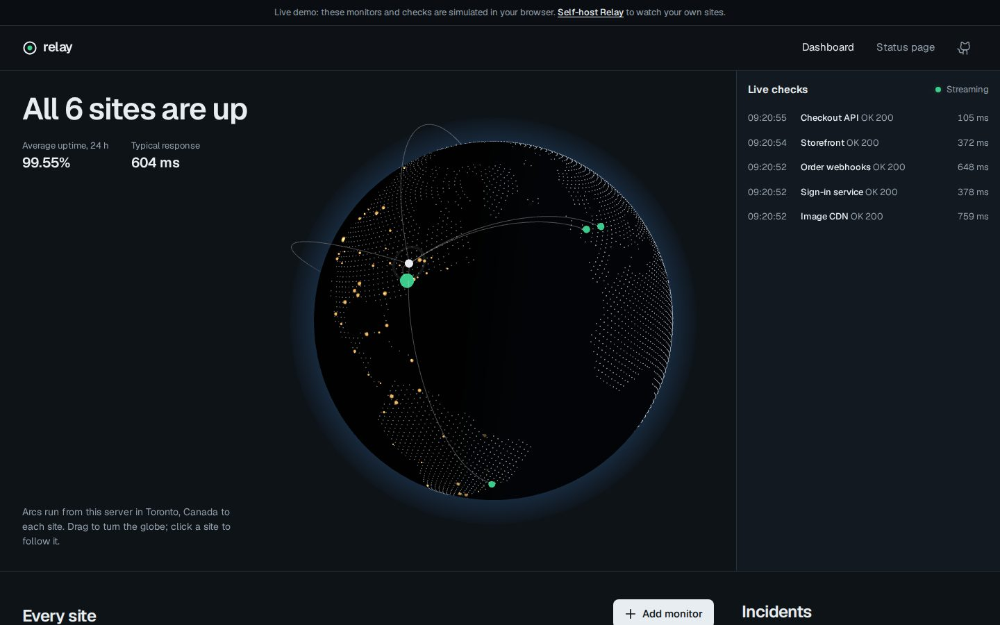
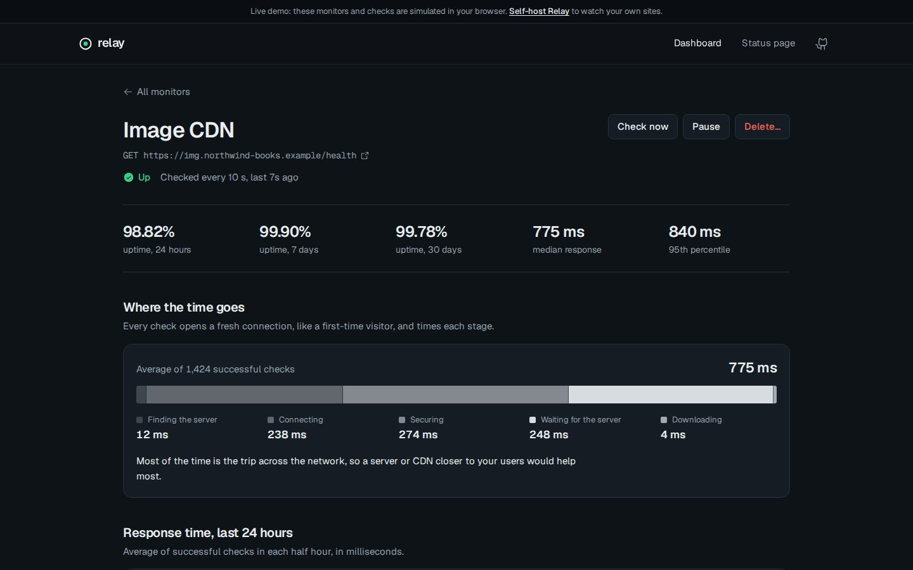
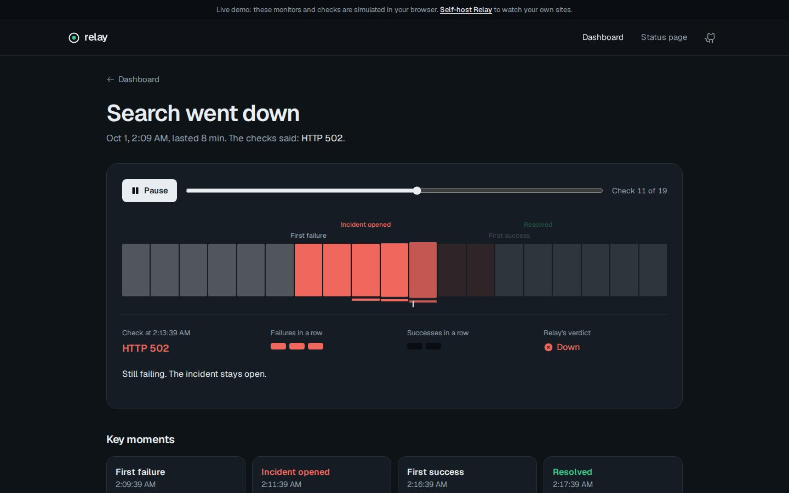

# Relay

[](https://github.com/CodingWithTaj/relay/actions/workflows/ci.yml)

Uptime monitoring you can host yourself, built around a live view of the planet. Relay checks your sites on a schedule, shows every check flying from your server to each site's data centre on a 3D globe, breaks each request down stage by stage, opens incidents after repeated failures, alerts your team on Discord or Slack, and publishes a status page.

**[Live demo](https://CodingWithTaj.github.io/relay/)** (monitors are simulated in your browser; self-host it to watch real sites)



| Control room | One site | Incident replay |
|---|---|---|
|  |  |  |

## What it does

- **Checks** any HTTP or HTTPS address every 10 seconds to 24 hours, with optional expected status codes and required page text.
- **Opens an incident only after 3 failed checks in a row**, dated from the first failure, and **closes it after 2 passing checks**, so one dropped request never pages anyone and a flapping service doesn't spam alerts.
- **Alerts** a Discord or Slack webhook once when an incident opens and once when it resolves.
- **Measures** uptime over 24 hours, 7 days and 30 days, median and 95th-percentile response times, and a 90-day daily history.
- **Shows the world**: a 3D globe where day and night follow the real sun, with arcs from your server to each site's data centre. Every check flies along its arc as it happens; an outage sends a shockwave out from the site. Click a site and the camera flies to it.
- **Breaks every request down**: finding the server (DNS), connecting, securing (TLS), waiting for the server, downloading. Each check uses a fresh connection, like a first-time visitor, and the page says in plain words whether a site is slow because of distance or because of the server.
- **Replays incidents** check by check, showing the failure counter fill up, the incident open, the alert go out, and the recovery.
- **Watches certificates**, reading each site's TLS certificate twice a day and warning two weeks before it expires.
- **Makes README badges** with live uptime, like ``.
- **Updates live**: the dashboard changes the moment a check finishes, over Server-Sent Events.
- **Publishes a status page** showing the monitors you mark public.
- **Is safe to put online**: changes need an admin token, and Relay refuses to check private, loopback and cloud-metadata addresses, so a public instance can't be turned against the network it runs in (SSRF protection).

## How it works

```text
React + Three.js site ──HTTP/SSE──▶ FastAPI ──▶ PostgreSQL (or SQLite)
                                       │
                                       └── scheduler: runs due checks concurrently with httpx,
                                           records results, opens/resolves incidents, sends alerts
```

`backend/relay/engine.py` holds the incident rules as plain logic with no networking or clock of its own, so every rule is tested directly. The scheduler fetches due monitors, runs their checks concurrently (bounded by a semaphore), and records all results in one transaction. Uptime and daily history are computed with SQL aggregates that work identically on SQLite and PostgreSQL; checks older than 90 days are pruned automatically.

The public demo runs without a server: `frontend/src/demo.ts` simulates the API in the browser, producing the same JSON and applying the same incident rule (`frontend/src/rules.ts` mirrors the Python one).

## Run it

**With Docker** (Relay, PostgreSQL, and a deliberately unreliable demo service to monitor):

```bash
ADMIN_TOKEN=choose-a-secret docker compose up
```

Open http://localhost:8000. Four demo monitors appear, including a slow page and a page with a scheduled outage, so you see a real incident within minutes.

**On Azure** (Container Apps plus Azure Database for PostgreSQL; Azure for Students credit covers it):

```bash
az login
ADMIN_TOKEN=choose-a-secret ./infra/azure-deploy.sh
```

**For development:**

```bash
cd backend && pip install -e ".[test]" && ADMIN_TOKEN=dev uvicorn relay.main:app --reload
cd frontend && npm install && npm run dev        # the dev server proxies /api to port 8000
```

Relay looks up where your server and each monitored site are (city level) with the free [ip-api.com](https://ip-api.com) service, which receives the site hostnames and your server's address. Private and local addresses are never sent. Set `GEOLOCATE=false` to turn this off; the globe then shows sites without arcs.

Settings are environment variables: `DATABASE_URL`, `ADMIN_TOKEN`, `ALERT_WEBHOOK_URL`, `FAIL_THRESHOLD` (3), `RECOVER_THRESHOLD` (2), `RETENTION_DAYS` (90), `STATUS_PAGE_TITLE`, and `ALLOW_PRIVATE_TARGETS` (off; turn on only for private-network setups like the Docker demo).

## Tests

```bash
pytest backend    # 30 tests
```

Request timing and certificates are tested against real local HTTP and HTTPS servers: a server that deliberately thinks for 60 ms must show up as 60 ms of waiting, and certificates made with `trustme` that expire in 10 days, or expired 2 days ago, must be reported exactly. The incident rules use a controllable clock and fake websites that fail, time out or redirect on cue, so timing is checked exactly: a full outage scenario asserts the incident starts at the first failure, resolves after the second success, sends exactly two alerts, and leaves 24-hour uptime at precisely 75%. The same scenario also runs against a real PostgreSQL (embedded with `pgserver`). CI runs the tests, type-checks and builds the site, builds the Docker image, and deploys the demo.

## Bugs the tests caught during development

- **Blank names were accepted.** Validation checked the length of `"   "` before stripping the spaces, so an empty name got through. Whitespace is now stripped first.
- **The 95th percentile was off by one sample.** Python's `round()` rounds 95.5 to the even number, 96. The nearest-rank method needs a ceiling.
- **A deploy script that would have failed on Azure.** An apostrophe inside a `${VAR:?message}` default broke bash's parsing. ShellCheck now passes.
- **The globe didn't know where its own server was.** The API sent the city as `place` while the site read `name`, so the dashboard said "this server in undefined". An end-to-end run against a real server caught it; a test now pins the shape. The same run found that an install with no monitors never looked its own location up.
- **The landing page overflowed on phones.** A grid without an explicit column let a long `git clone` line widen the whole page.

## Limits

One process runs the checks, so this suits up to a few thousand monitors; beyond that, the scheduler would move to a queue with several workers. Checks come from a single location, so Relay can't tell a regional outage from a global one. Alerts go to webhooks only (no email or SMS).

## License

MIT
